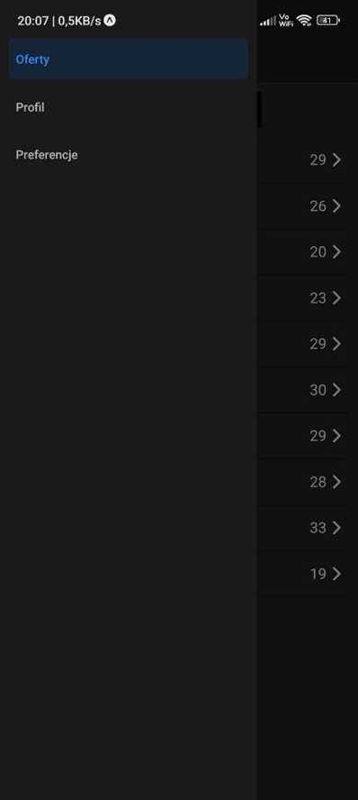

# ContractFinderFront

> Front-end mobile application for **ContractFinder** — a platform that connects employers and employees for short-term or contract-based jobs.

---

## Overview

`ContractFinderFront` is a **React Native (Expo)** mobile application built using **TypeScript**.  
It serves as the front-end interface for the **ContractFinder** ecosystem, allowing users to:
- Create accounts as employers or employees,
- Browse and apply for short-term jobs,
- Post work offers,
- Manage applications,
- And communicate through a clean, user-friendly interface.

This application integrates directly with the backend service [`ContractFinderBack`](https://github.com/dr34ke/ContractFinderBack).

---

## Features

- **Authentication** (Login, Register, Logout)
- **User Profiles** and Preferences Management
- **Job Offers** Listing and Filtering
- **Applications** (Apply / Accept / Reject Work Offers)
- **Ratings and Reviews**
- **Notifications** and real-time status updates
- **Smooth Navigation** powered by React Navigation
- **Responsive UI** for both Android & iOS (Expo-compatible)

---

## Tech Stack

| Component | Technology |
|------------|-------------|
| Framework | **React Native** (Expo) |
| Language | **TypeScript** |
| State Management | Zustand (via `/src/stores/`) |
| API Layer | Custom API service (`src/api/apiService.ts`) |
| Navigation | React Navigation (`src/navigation/appNavigation.tsx`) |
| Storage | AsyncStorage wrapper (`src/helpers/StorageHelper.ts`) |
| Backend | [ContractFinderBack (Go + MongoDB)](https://github.com/dr34ke/ContractFinderBack) |
| Styling | React Native Styles / Custom Components |
| Build Tool | Expo CLI |

---

## Directory Layout
src/  
├── App.tsx Main application entry  
├── api/ API integration and network logic  
│ └── apiService.ts  
├── components/ Reusable UI components (inputs, buttons, selectors)  
│ ├── OwnInput.tsx  
│ ├── ownButton.tsx  
│ ├── ownSelect.tsx  
│ └── ownSwitch.tsx  
├── constans/ Static constants (URLs, config)  
│ └── URLs.ts  
├── helpers/ Utility helpers (token, storage, etc.)  
│ ├── StorageHelper.ts  
│ └── TokenHelper.ts  
├── models/ TypeScript interfaces and models  
│ ├── Offer.ts  
│ ├── UserProfile.ts  
│ ├── WorkCategory.ts  
│ └── UserRating.ts  
├── navigation/ Application navigation stack  
│ └── appNavigation.tsx  
└── stores/ Global state management (Zustand stores)  
├── offersStore.ts  
├── userStore.ts  
└── usersProfile.ts  

<table>
<tr>
<td align="center">
<b>Add Localisation</b> 

</td>
<td align="center">
<b>Add New Offer</b> 

</td>
<td align="center">
<b>Apply</b> 

</td>
</tr>

<tr>
<td align="center">
<b>Categories</b> 

</td>
<td align="center">
<b>Login</b> 

</td>
<td align="center">
<b>Notiffication</b> 

</td>
</tr>

<tr>
<td align="center">
<b>Offer</b> 

</td>
<td align="center">
<b>Offers Map</b> 

</td>
<td align="center">
<b>Offers</b> 

</td>
</tr>

<tr>
<td align="center">
<b>Preferences</b> 

</td>
<td align="center">
<b>Profile</b> 

</td>
<td align="center">
<b>Public Profile</b> 

</td>
</tr>

<tr>
<td align="center">
<b>Register</b> 

</td>
<td align="center">
<b>Sidemenu</b> 

</td>
</tr>
</table>

